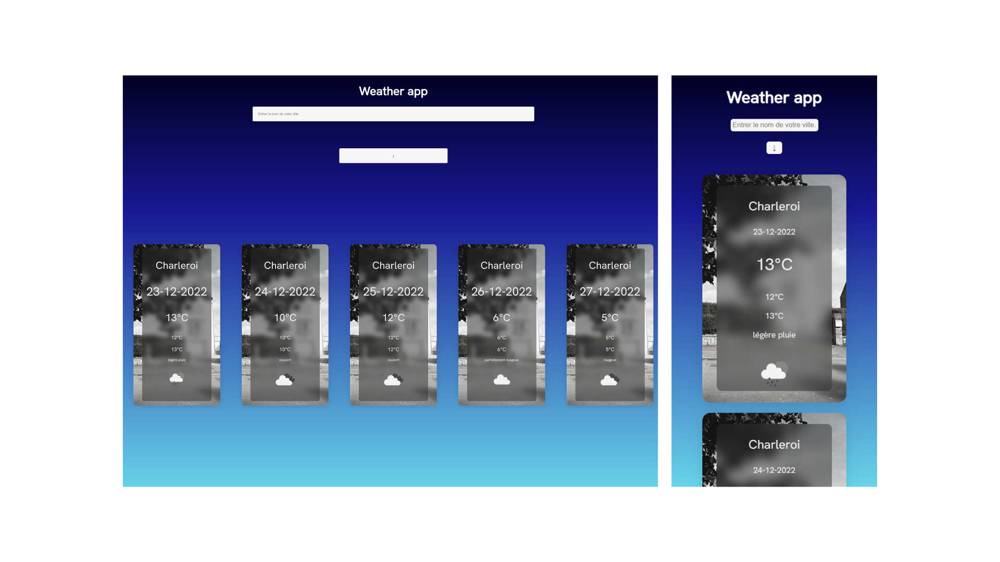

# weather-app

---

Project completed

For this project, I created a weather application that retrieves its data via the Openweathermap api. When you enter the name of a city, the data appears and the forecasts are made for five days. This application is responsive.
Moreover, with the Unsplash api generating photos corresponding to the cities entered, the background is automatically updated. This project is an exercise realized during the training web developer junior given by Becode.org

---

## Language

- HTML
- SCSS
- JS

---

## How to install the repository locally

1. create a local working folder
2. open Git Bash
3. clone the repository
4. now you can work on the file

---

[Link to my Github page.](https://mathildecornelis.github.io/weather-app/)
